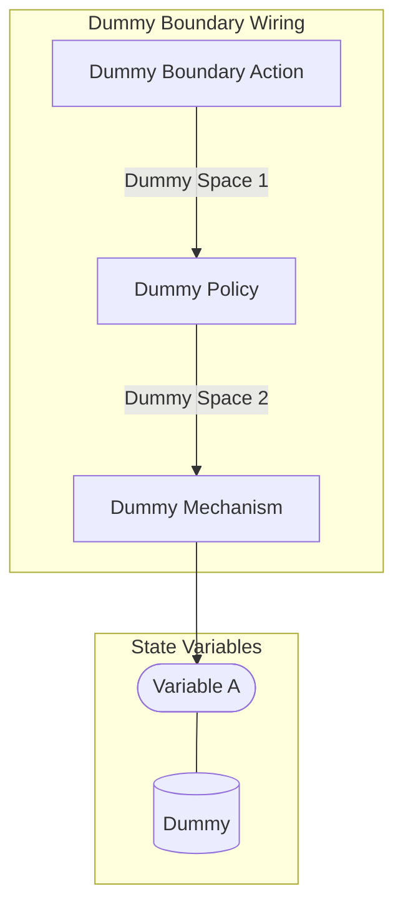
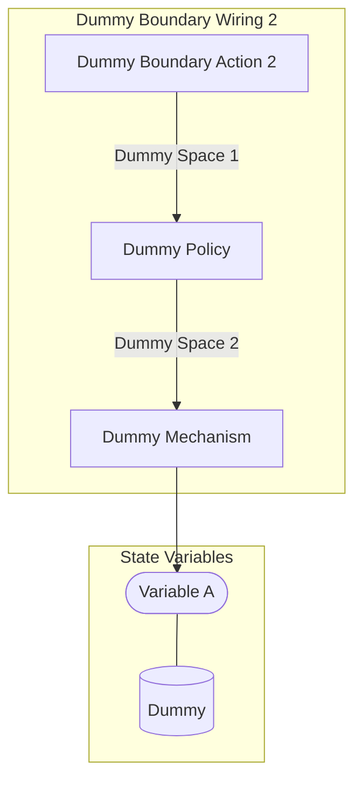
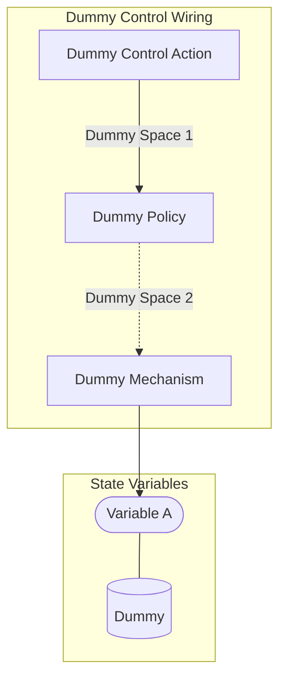
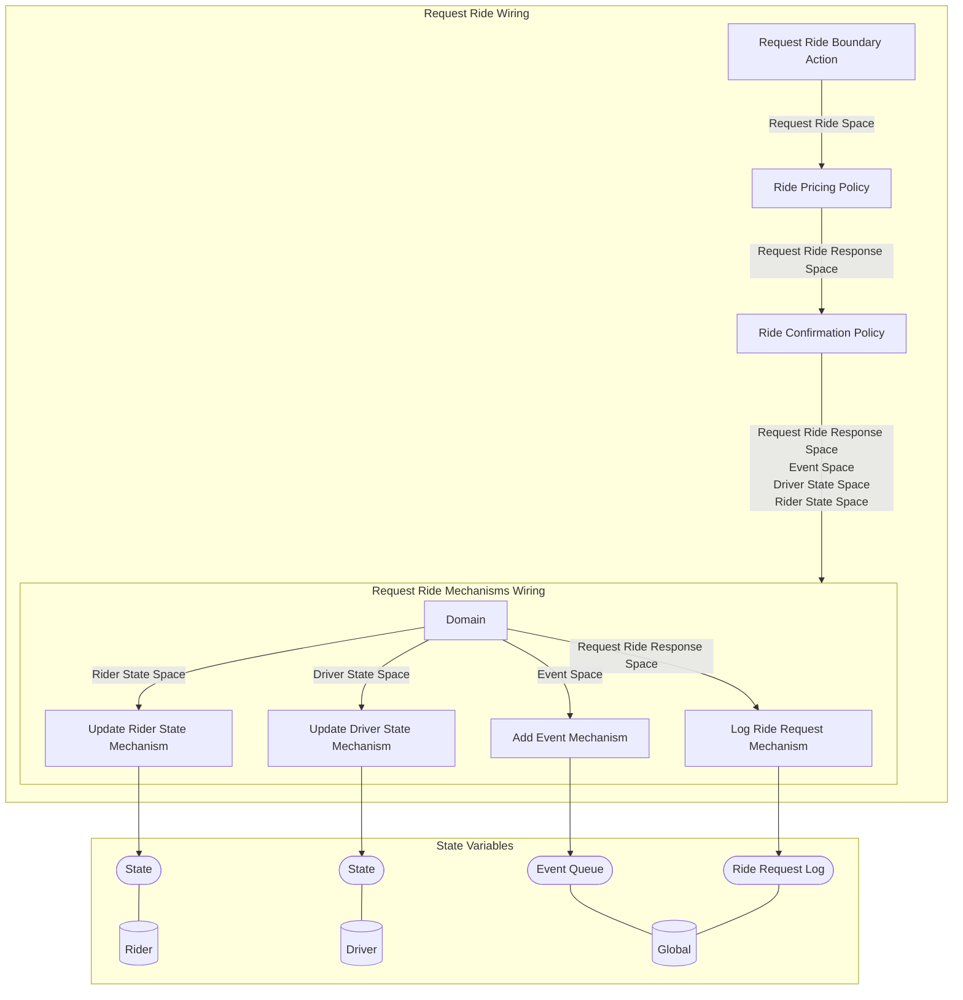

## Wiring Diagrams

## Description

The wirings which are not components of other wirings.
## Wirings
1. [[Dummy Boundary Wiring]]
2. [[Dummy Boundary Wiring 2]]
3. [[Dummy Control Wiring]]
4. [[Request Ride Wiring]]

## Unique Components Used
1. [[Add Event Mechanism]]
2. [[Dummy Boundary Action]]
3. [[Dummy Boundary Action 2]]
4. [[Dummy Control Action]]
5. [[Dummy Mechanism]]
6. [[Dummy Policy]]
7. [[Log Ride Request Mechanism]]
8. [[Request Ride Boundary Action]]
9. [[Ride Confirmation Policy]]
10. [[Ride Pricing Policy]]
11. [[Update Driver State Mechanism]]
12. [[Update Rider State Mechanism]]

## Unique Parameters Used
1. [[dummy_parameter]]

