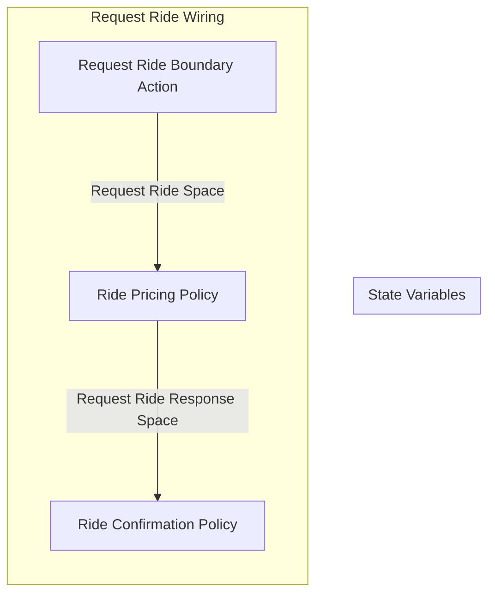

## Wiring Diagrams

## Description

The wirings related to only boundary type actions.
## Wirings
1. [[Dummy Boundary Wiring]]
2. [[Dummy Boundary Wiring 2]]
3. [[Request Ride Wiring]]

## Unique Components Used
1. [[Dummy Boundary Action]]
2. [[Dummy Boundary Action 2]]
3. [[Dummy Mechanism]]
4. [[Dummy Policy]]
5. [[Request Ride Boundary Action]]
6. [[Ride Confirmation Policy]]
7. [[Ride Pricing Policy]]

## Unique Parameters Used
1. [[dummy_parameter]]

