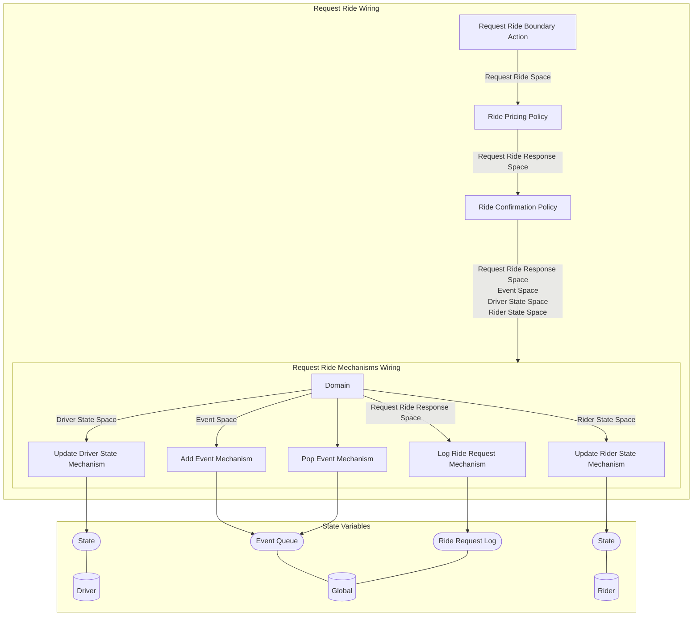

## Wiring Diagrams

## Description

The wirings related to only boundary type actions.
## Wirings
1. [[Request Ride Wiring]]

## Unique Components Used
1. [[Add Event Mechanism]]
2. [[Log Ride Request Mechanism]]
3. [[Pop Event Mechanism]]
4. [[Request Ride Boundary Action]]
5. [[Ride Confirmation Policy]]
6. [[Ride Pricing Policy]]
7. [[Update Driver State Mechanism]]
8. [[Update Rider State Mechanism]]

## Unique Parameters Used

