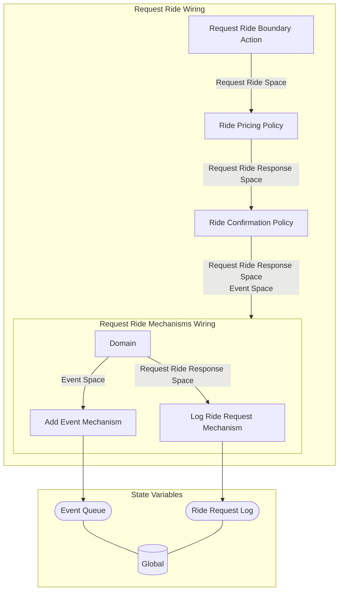

## Wiring Diagrams

## Description

The wirings related to what actions riders take.
## Wirings
1. [[Request Ride Wiring]]

## Unique Components Used
1. [[Add Event Mechanism]]
2. [[Log Ride Request Mechanism]]
3. [[Request Ride Boundary Action]]
4. [[Ride Confirmation Policy]]
5. [[Ride Pricing Policy]]

## Unique Parameters Used

