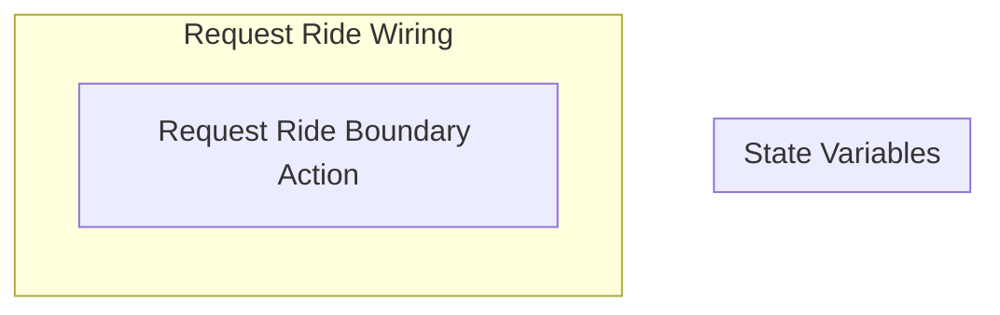

## Wiring Diagrams

## Description

The wirings related to what actions riders take.
## Wirings
1. [[Request Ride Wiring]]

## Unique Components Used
1. [[Request Ride Boundary Action]]

## Unique Parameters Used

