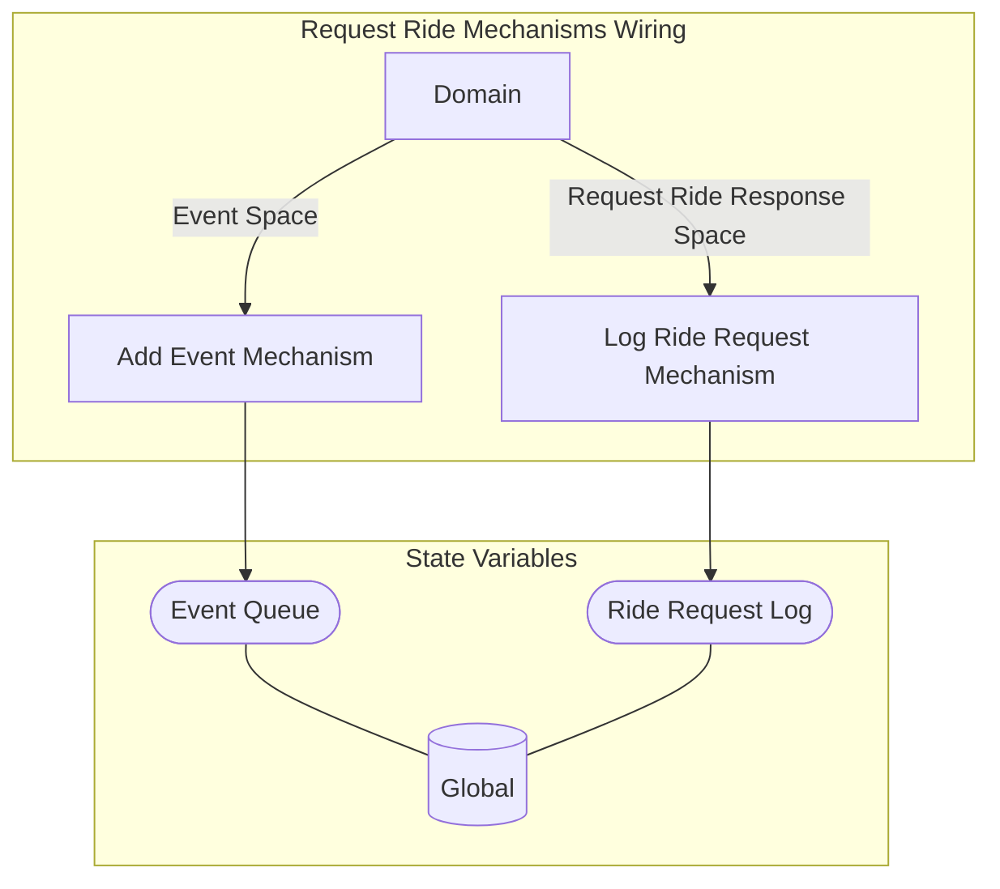

## Wiring Diagram

## Description

Block Type: Parallel Block
Mechanism for ride requests
## Components
1. [[Log Ride Request Mechanism]]
2. [[Add Event Mechanism]]

## All Blocks
1. [[Add Event Mechanism]]
2. [[Log Ride Request Mechanism]]

## Constraints

## Domain Spaces
1. [[Request Ride Response Space]]
2. [[Event Space]]

## Codomain Spaces
1. [[Empty Space]]

## All Spaces Used
1. [[Empty Space]]
2. [[Event Space]]
3. [[Request Ride Response Space]]
4. [[Terminating Space]]

## Parameters Used

## Called By

## Calls

## All State Updates
1. [[Global]].[[Global State-Event Queue|Event Queue]]
2. [[Global]].[[Global State-Ride Request Log|Ride Request Log]]

