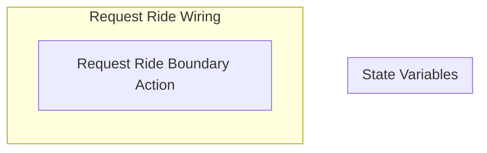

## Wiring Diagram

## Description

Block Type: Stack Block
The action of a rider requesting a ride.
## Components
1. [[Request Ride Boundary Action]]

## All Blocks
1. [[Request Ride Boundary Action]]

## Constraints

## Domain Spaces

## Codomain Spaces
1. [[Dummy Space 1]]

## All Spaces Used
1. [[Dummy Space 1]]

## Parameters Used

## Called By

## Calls

## All State Updates

