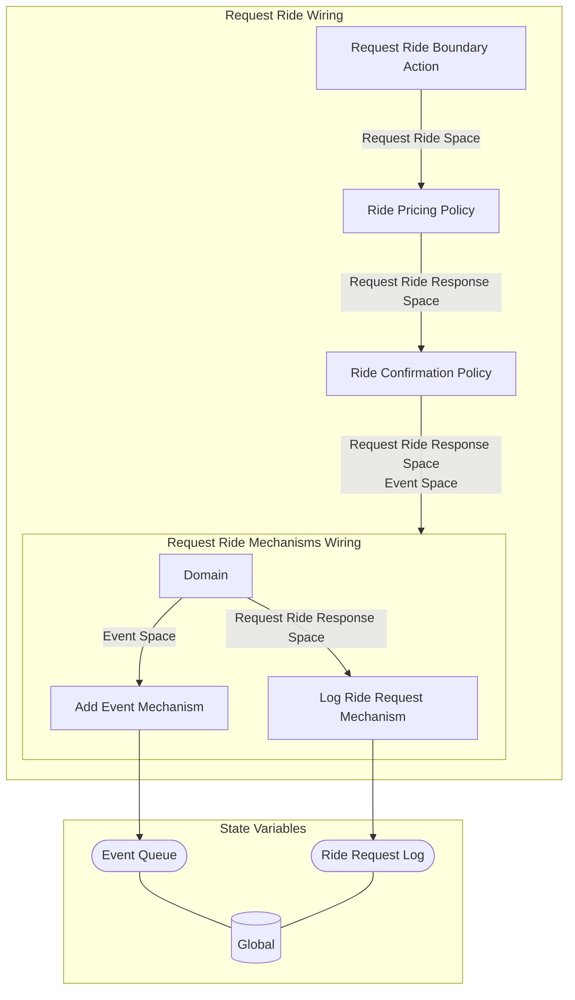

## Wiring Diagram

## Description

Block Type: Stack Block
The action of a rider requesting a ride.
## Components
1. [[Request Ride Boundary Action]]
2. [[Ride Pricing Policy]]
3. [[Ride Confirmation Policy]]
4. [[Request Ride Mechanisms Wiring]]

## All Blocks
1. [[Add Event Mechanism]]
2. [[Log Ride Request Mechanism]]
3. [[Request Ride Boundary Action]]
4. [[Ride Confirmation Policy]]
5. [[Ride Pricing Policy]]

## Constraints

## Domain Spaces

## Codomain Spaces
1. [[Empty Space]]

## All Spaces Used
1. [[Empty Space]]
2. [[Event Space]]
3. [[Request Ride Response Space]]
4. [[Request Ride Space]]
5. [[Terminating Space]]

## Parameters Used

## Called By

## Calls

## All State Updates
1. [[Global]].[[Global State-Event Queue|Event Queue]]
2. [[Global]].[[Global State-Ride Request Log|Ride Request Log]]

